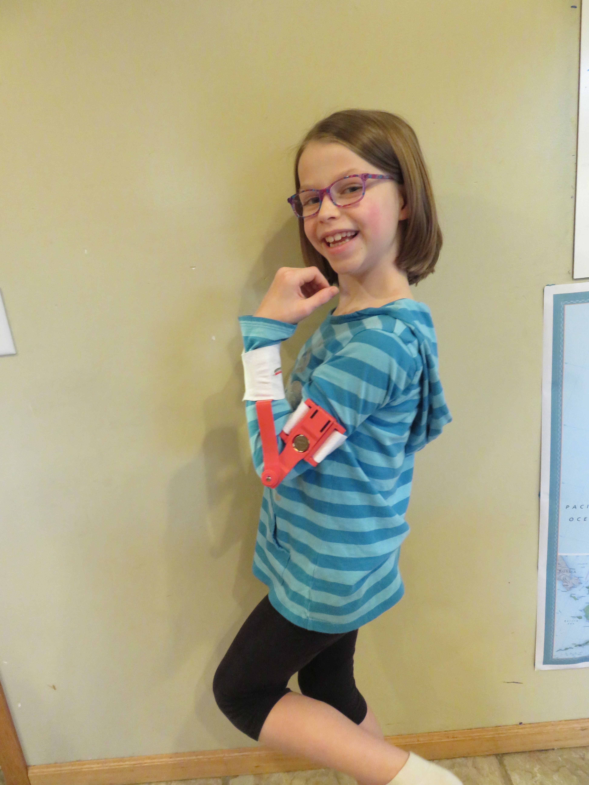
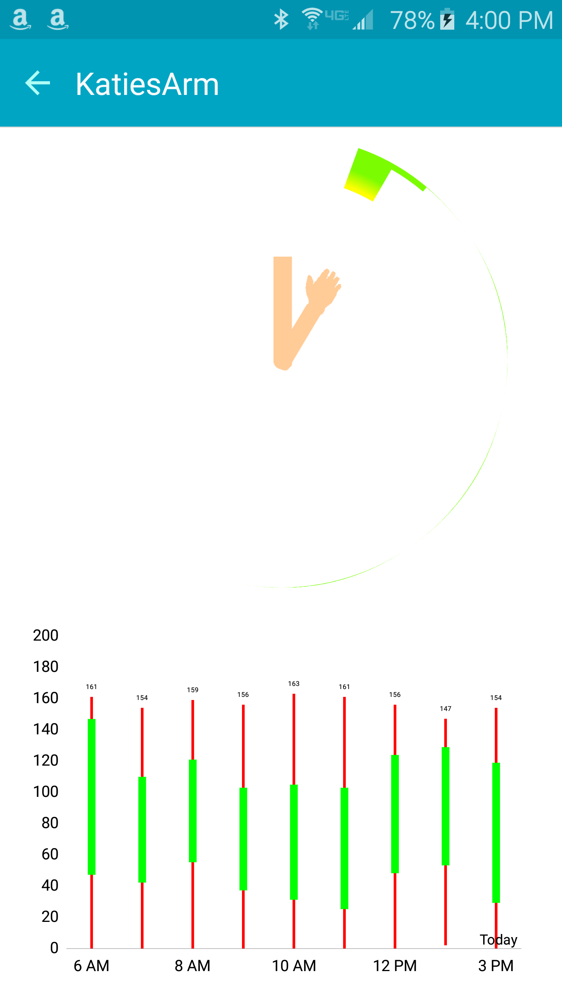

# LiveJointsAndroid

Real time encouragement for stretching exercises after surgery on a joint

LiveJoints is a combination hardware / software project to provide real time feedback to a patient during a joint therapy session.  This project was started to create a fun way to encourage my daughter to continue her stretching exercises after an injury to her elbow.  Traditional Physical Therapy could benefit by the gamification and machine learning technologies to encourage the patient to reach past their goals.

 

This project is no longer supported but is available as an idea starter for you in hopes that you will create services to encourage movement of joints after an injury.  The code no longer works since the Parse service was shut down.

## Background

On Tuesday November 25, 2014 my daughter, Katie, fractured her upper arm right near the elbow's radial head.  Her arm was pinned and cast however it did not heal properly.  Even with Physical Therapy, her range of motion was severely limited.  

When her arm hit her maximum flexion, she experienced pain.  She could not do common things such as brush her hair and stopped doing one of her favorite activities, gymnastics.  Due to the extreme pain at the end range, she preferred to use her other arm and simply cradled her injured arm.  Without use, the arm would simply lose range of motion over time as the scar tissue will not break down. We pursued two routes.  1) Revision surgery and 2) Encourage stretching and using the arm.

To be a valid candidate for revision surgery on the joint, the doctor required Katie to use arm stretchers to obtain the maximum range of motion prior to surgery.  She was supposed to use a device to stretch it at least two times per day however we found that we had to remind her or it would not be done.  Meanwhile, because it hurt to use the arm, she used it less and less each day.  Thus, this project.

## Software

The device contained a RFDuino which read the arm position from the sensor every 1/2 second.  The reading was sent to the Android tablet.  The tablet recorded the angle readings for each minute, calculated usage statistics for that minute, then posted the data to a cloud database on Parse.com.

Joint movement visualization
* The Android application I made showed a modified pie chart that looked like a partial ring.  The amount of the ring shown corresponded to the current angle of the arm.
* I added another chart to show the amount of movement over time.  This chart showed an analysis by the minute for the last ten minutes.  It depicted the extreme angles of movement as well as showing the position the arm was mostly in.
* While the modified pie chart showed the current angle of the arm and the time lapse chart showed a summary of recent movement, it was not a "quick glance to understand" or a compelling user experience.  After much thought, I created a new chart that shows in easily recognizable format all of the desired characteristics.  The current position is depicted by the animated arm pointing in the same angle as the real arm on the patient.  While the arm is pointed in a position, the chart at that angle is "eaten away" so the amount of the circle chart for that angle goes from red to yellow then to green and after the arm has been at that angle long enough only the shell of the chart is left at that angle.  This gives a comprehensive view of how long the arm was in each position.  This also gamified the experience so my daughter tried to see if she could eat the whole chart by moving her arm in all the angles she could. 

## Additional options

I have since abandoned this project however you can feel free to pick it up or any parts of it.  Here are additional thoughts I had:

* The app software will be run with Berkeley's SNAP! program so it is easy to prototype and so my daughter's brothers can make their own fun games for her.

Other options considered:
* Simply strap augmented reality markers to the upper and lower arm then watch with Unity3d + Qualcomm Vuforia.
 * This would be fairly easy to do but limited to mobile devices only for now since Vuforia is meant for Android / iOS.
* Gyro and accelerometers can be on arm bands attached to the upper and lower arm then the delta of the angle can infer the angle of the elbow.

Long term, it may be nice to make an apparatus that can stay on her arm as part of her clothes so we can get live and accumulated biometrics.  Similar to people wearing pedometers to improve their health throughout the day, having statistics available in real time and throughout the day may allow others to encourage her if the desired activity has not taken place.

Statistics would come in handy for creating the necessary encouragement points.  Machine learning may enable the application to automatically assess abilities and with input from a therapist, chart the appropriate plan.

Splint mechanics
* Custom splint that has movable joint but turns rigid immediately if fall or external force applied such as bumping into something.
 * Sense capability
	* Sense fall with accelerometer / gyro
	* Sense bump  with accel/gyro jerk, force applied from internal vs external.  
	* External force detection all around to detect if force started external or internal
	* Sense if small or big force.  Lock joint if force not gentle (trying to lift something or quickly move).
 * Brace feature
		* Hinge freely rotates when no impact pending.
		* Multi pins on joint disengaged.  To engage, electromagnetic or CO2 type pneumatic pushes all pins into circular hinge and based on angle, one or more of those pins locks the hinge.
		* Electrically deformable material such as muscle wire contracts to deform the hinge surface enough to lock it or provide resistance to slow the movement.
		* Cylindars such as in old cordless screwdrivers allow movement if initiated from inside (arm) but locks immediately upon external force overriding the internal movement.
		* May include a shock absorber to reduce impact instead of abrupt stop
		* Integrate sensor into hinged splint to detect rom and movement.
		* Attachment for passive ROM on hinge.
		
Joint angle sensing
* Method of attachment
 * May be attached to arm
 * May be attached to ROM stretcher like JAZ splint
 * Built into clothing
 * Tape on like bandaid
* Methods of sensing
	* Multiple sensor integration
		* Accelerometer
			* http://www.mdpi.com/1424-8220/10/12/11556/pdf
			* http://pdxscholar.library.pdx.edu/cgi/viewcontent.cgi?article=1660&context=open_access_etds
			* https://www.google.com/url?sa=t&rct=j&q=&esrc=s&source=web&cd=14&cad=rja&uact=8&ved=0ahUKEwiH7YvB2fXMAhWJbz4KHeT7DLAQFghfMA0&url=http%3A%2F%2Fpdxscholar.library.pdx.edu%2Fcgi%2Fviewcontent.cgi%3Farticle%3D1660%26context%3Dopen_access_etds&usg=AFQjCNGkpsW7YH76WWVcBWkzOfsrHHgtdw&bvm=bv.122852650,d.cWw
		* Gyro
		* Electromagnetic like Sixense STEM system http://sixense.com/wireless
		* Radar like Google's project Soli
		* Potentiometer
		* Optical encoder
		* Magnetic encoder
		* Camera, infrared, 3d camera
		* Capacitive
		* Combo like the mit position sensing
		* Resistive force sensing (strain sensors)
			* https://micro.seas.harvard.edu/papers/Menguc_ICRA13.pdf
			* https://jneuroengrehab.biomedcentral.com/articles/10.1186/1743-0003-2-7
	
	* Sensing capability
		* Sensor directly at joint
		* Angle of joint coupled to sensor offset from joint (such as my control arm version)
		* Remote sensing from another body part.  Radar on upper arm watches lower arm placement.
		* Remote sensing from remote device such as ipad camera on table, tv camera with app on tv.
		* Device in pocket may watch limb movements via radar
	* Calibration methods
		* Inward pointing radar like Google project Soli may detect bone direction vs attachment direction and compensate for loose fitting or moving or misaliagned attachment.
		* Capacitive detection of alignment on arm will help identify when out of position.  Capacitive sensors on sides then if one has different value, may have slipped past flesh of arm. 
		* Fiducials or other inherent geometries on the device may allow recognition of the angle of each device part to be determined using a normal smartphone camera and common algortithms.
	* Device communication methods
		* Wifi
		* Bluetooth
	* Battery Savings measures
		* Send real time position only if the user is viewing the app at the moment.  2 Way communication to the bluetooth device tells the device the user is / is not on a real time display and the device sends the data immediately or in aggregate based on this information.  If the application is in the background for instance, the device may aquire many samples before sending in order to save energy on transmission.
		* The sensor device and / or Android device may detect the signal strength is strong enough that the sensor device can lower its transmission power and still be able to communicate, thus saving battery.  Likewise, when the received signal strength is low or there are missing packets, the sensor device may increase transmission power until an optimum power is found to convey data and save battery.

Metrics
* Time spent with little movement
* Time spent at extremes.
* Detect end of motion by 
	* watching vascilations in the angle (trembling)
	* Angle
	* Estimate exertion from sweat, blood pressure, heart rate or tone of voice.	
* Compare rom extremes day by day to understand improvement.
	
Display, gamification
* Set goals for ROM.  May need to hit certain ROM prior to surgery
* Compare good joint with other joint to see if can get similar movement
* Games
	* Eat circle chart by pointing to each segment.  (existing prototype)
		* Adaptive to end ROM with smaller segments at ends.
		* Hand fires bullets at circle chart to eat it piece by piece.
	* Missle command style game where aliens come from angle of arc.  Fire turret by moving arm
		* Place aliens at end ROM for periods to stretch then in middle or other extreme to rest that direction
	* Gravity based missle launch angry bird style.
* Sharing
	* Others can set goals/rewards.  Preselect options include food, online time, 
	* When goal met, notification can be sent to partners
Partners can see progress in real time regardless of goal met.  (Check up on progress of parent knee rehab).

